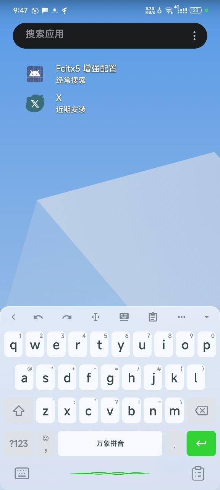
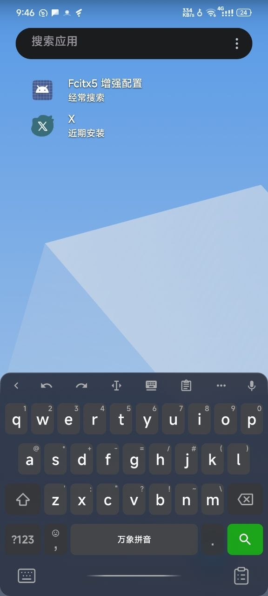

# Fcitx5 增强

<div align="center">

一个 LSPosed 模块，为 [原版 fcitx5-android](https://github.com/fcitx-android/fcitx5-android) 与[靓企鹅](https://github.com/fxliang/fcitx5-android)（fx 版）提供**键盘背景美化**、**按键描边**与**快捷工具**。


</div>

| 语音调用 | 亮色模式 | 暗色模式 |
|:-:|:-:|:-:|
|  |  |  |

## 主题浏览

🎨 **[小企鹅主题商店](https://rebron1900.github.io/f5a-gallery/)** — 在线浏览和预览 fcitx5-android 键盘主题，支持实时键盘模拟器预览效果，一键复制或下载主题 JSON。

## 功能

**🎨 键盘美化**
- 键盘背景**磨砂玻璃**效果（真实 `BlurDrawable`，非伪毛玻璃）
- 自定义**圆角**（全局统一，覆盖键盘本体与弹窗）
- 描边颜色**自动推导自主题背景色**
- **暗色主题自适应**（浅色/深色主题自动切换风格）

**✨ 按键玻璃描边** (v1.3.0)
- 每个按键**左上↔右下对角线渐变描边**，模拟玻璃反光质感
- **内描边**设计：描边位于按键视觉区域内部，不撑大按键
- **自动对齐**：描边的圆角与边距从小企鹅主题配置读取，与输入法按键完全一致
- **主题实时跟随**：切换暗色/亮色主题，描边透明度自动适配
- 支持插件开关，无需也可关闭

**🎛️ 可配置参数**（设置界面实时调节）
- 模糊半径 (0–100)
- 背景透明度 (0–255)
- 圆角半径 (0–48)
- **按键描边开关** (v1.3.0)

**⌨️ 快捷工具栏**
- **左下角**：IME 切换按钮 → 弹出系统输入法选择列表
- **右下角**：剪贴板按钮 → 弹出最近 10 条剪贴板记录
- **底部中间**：频谱波形线（空闲水平渐隐线 / 录音时实时 RMS 振幅动画）

**🎤 语音输入**
- 长按波形线区域录音，松开提交
- 集成 bibi keyboard 语音识别服务
- 实时振幅波形反馈

> ⚠️ 语音输入仅限 靓企鹅（fx 版）。原版 fcitx5-android 无录音权限，语音按钮与开关自动隐藏。

## 环境要求

| 项目 | 要求 |
|---|---|
| 设备 | Android 12+ (API 31+) |
| Root | [LSPosed](https://github.com/LSPosed/LSPosed) 已激活 |
| 输入法 | [原版 fcitx5-android](https://github.com/fcitx-android/fcitx5-android) 或 [靓企鹅](https://github.com/fxliang/fcitx5-android) |
| 语音（可选） | [BiBi-Keyboard（说点啥）](https://github.com/BryceWG/BiBi-Keyboard) 或兼容 AIDL 服务 |

## 安装

1. 下载最新 [Release APK](https://github.com/rebron1900/fcitx5-enhanced/releases)
   - 也可通过 [Xposed Modules Repo](https://github.com/Xposed-Modules-Repo/com.rebron1900.fcitx5enhanced) 获取
2. 在 LSPosed 中激活模块，作用域勾选 `org.fcitx.fcitx5.android`（原版）或 `org.fcitx.fcitx5.android.fx`（靓企鹅）
3. 重启 fcitx5 进程（或重启设备）
4. 在桌面应用列表中找到 **Fcitx5 增强配置**，调节参数

> 升级新版本前需**先卸载旧版 APK**（签名冲突），再安装新版。

## 从源码编译

```bash
git clone https://github.com/rebron1900/fcitx5-enhanced.git
cd fcitx5-enhanced
./gradlew assembleRelease
# 产物在 app/build/outputs/apk/release/
```

> 生成的 APK 需要签名后才能安装。Release 版本由 CI 自动签名。

## 致谢

- [WeType_UI_Enhanced](https://github.com/NEORUAA/WeType_UI_Enhanced) — UI 增强灵感
- [WaveLineView](https://github.com/Jay-Goo/WaveLineView) — 录音波形动画（振幅响应管线参考）
- [原版 fcitx5-android](https://github.com/fcitx-android/fcitx5-android) — Android 输入法
- [靓企鹅](https://github.com/fxliang/fcitx5-android) — fxliang 的 fork，支持自定义主题
- [BiBi-Keyboard（说点啥）](https://github.com/BryceWG/BiBi-Keyboard) — 语音识别服务

## 许可证

[GNU General Public License v3.0](LICENSE)

## 更新日志

### v1.5.0
- 支持原版 fcitx5-android（`org.fcitx.fcitx5.android`）与靓企鹅（`org.fcitx.fcitx5.android.fx`）双包名
- 原版运行时自动隐藏语音按钮、禁用语音开关（无录音权限）
- 适配原版 R8 混淆：磨砂背景、预编辑、按键特效改用类型匹配与 View 遍历
- 修复原版上配置同步问题（旧 view 引用清理）
